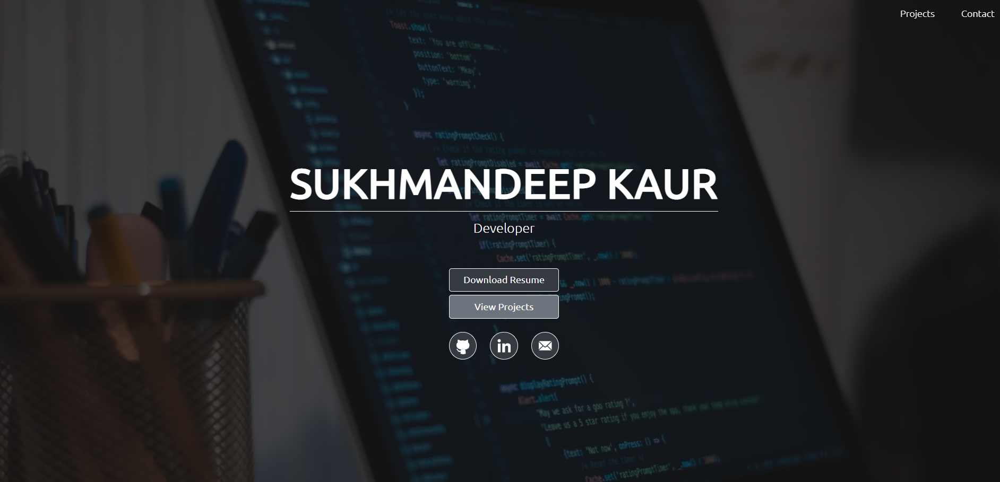
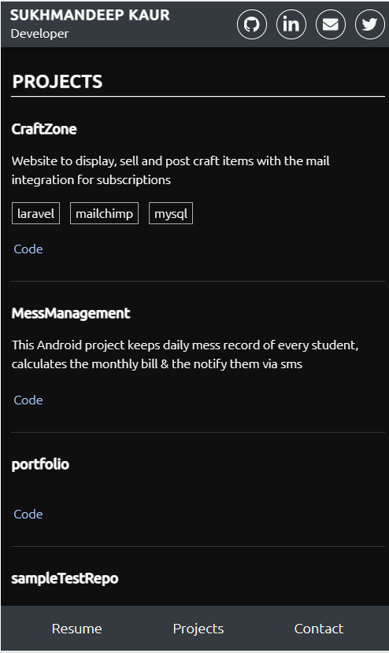

# Portfolio

A mobile-responsive portfolio scaffold. The live version can be found here: https://sukhman-kaur.github.io/portfolio/ 

Built using React.js.

## Example
### Web view

### Mobile view

## Deployment on Github Pages
1. Follow instructions in https://chrisdevcode.hashnode.dev/github-pages-with-react
2. In the project directory, run `npm run deploy`.

